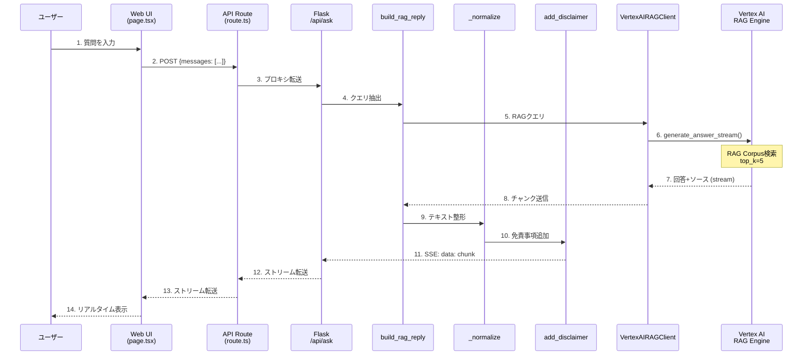
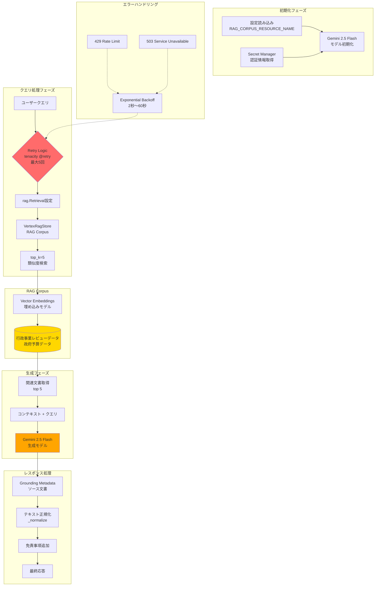

# GovGov システムアーキテクチャ

## 目次

1. [システム全体図](#1-システム全体図)
2. [GovGovBot アーキテクチャ](#2-govgovbot-アーキテクチャ)
3. [GovGovWeb アーキテクチャ](#3-govgovweb-アーキテクチャ)
4. [API呼び出しフロー](#4-api呼び出しフロー)
5. [RAG実装詳細](#5-rag実装詳細)

---

## 1. システム全体図

```mermaid
graph TB
    %% ユーザー
    WebUser[Webユーザー]
    TwitterUser[Twitterユーザー]

    %% フロントエンド
    WebApp[govgovweb<br/>Next.js on Cloud Run]

    %% バックエンド
    Bot[govgovbot<br/>Flask API on Cloud Run]

    %% GCP AI/ML
    RAG[Vertex AI<br/>RAG Engine]
    Search[Vertex AI<br/>Search]

    %% GCP データ
    Firestore[(Firestore<br/>状態管理)]
    GCS[(Cloud Storage<br/>チェックポイント)]
    Secrets[Secret Manager<br/>認証情報]

    %% 外部API
    Twitter[Twitter API v2]

    %% Web UIフロー
    WebUser -->|HTTPS| WebApp
    WebApp -->|POST /api/ask<br/>SSE Stream| Bot

    %% Twitter Botフロー
    TwitterUser -->|@mention| Twitter
    Bot <-->|Poll/Post| Twitter

    %% バックエンド -> GCP
    Bot -->|RAGクエリ| RAG
    Bot -.->|検索クエリ| Search
    Bot -->|状態追跡| Firestore
    Bot -->|チェックポイント| GCS
    Bot -->|認証情報取得| Secrets

    %% レスポンス
    RAG -->|回答+ソース| Bot
    Bot -->|ストリーミング| WebApp
    WebApp -->|表示| WebUser

    style WebApp fill:#6AD3DD
    style Bot fill:#328DCA
    style RAG fill:#FFA500
    style Search fill:#FFA500
```

**主要コンポーネント:**

- **govgovweb**: Next.js 14フロントエンド（Cloud Run）
- **govgovbot**: Flask APIバックエンド（Cloud Run）
- **Vertex AI RAG Engine**: 行政事業レビューデータを使ったRAG
- **Vertex AI Search**: フォールバック検索
- **Firestore**: リプライ済みメンション管理
- **Cloud Storage**: チェックポイント保存
- **Twitter API v2**: メンション取得とツイート投稿

---

## 2. GovGovBot アーキテクチャ

### 2.1 Flask APIエンドポイント構造

```mermaid
graph TB
    subgraph "Flask API (govgovbot)"
        subgraph "HTTPエンドポイント"
            Health[/healthz<br/>ヘルスチェック]
            AskAPI[/api/ask<br/>Web UIクエリ<br/>SSEストリーミング]
            TweetAPI[/tweet<br/>ツイート投稿]
        end

        subgraph "定期タスク (Cloud Scheduler)"
            ReplyLatest[/tasks/reply-latest<br/>最新メンションに返信]
            ReplyBatch[/tasks/reply-new-mentions<br/>バッチ処理]
            MentionsOnce[/tasks/mentions-run-once<br/>冪等処理]
        end

        subgraph "ビジネスロジック"
            RAGReply[build_rag_reply<br/>RAG応答生成]
            Normalize[_normalize<br/>テキスト整形]
            FetchConv[fetch_conversation_tweets<br/>スレッド取得]
            AlreadyReplied[_already_replied_to<br/>重複チェック]
        end

        subgraph "共通ユーティリティ"
            RAGClient[VertexAIRAGClient<br/>RAG Engineクライアント]
            SearchClient[VertexSearchClient<br/>検索クライアント]
            Config[config.py<br/>設定管理]
            Disclaimer[disclaimer.py<br/>AI免責事項]
            Prompt[factcheck_prompt.py<br/>システムプロンプト]
        end

        subgraph "状態管理"
            SQLite[(SQLite<br/>/state.db)]
            FirestoreDB[(Firestore)]
        end
    end

    AskAPI --> RAGReply
    ReplyLatest --> RAGReply
    ReplyBatch --> RAGReply
    RAGReply --> RAGClient
    RAGReply --> Normalize
    Normalize --> Disclaimer
    ReplyLatest --> AlreadyReplied
    AlreadyReplied --> FirestoreDB
    AlreadyReplied --> SQLite
    FetchConv --> TwitterAPI[Twitter API]
    RAGClient --> Config
    RAGClient --> Prompt

    style RAGReply fill:#FFD700
    style RAGClient fill:#FFA500
```

### 2.2 主要機能の説明

| エンドポイント | メソッド | 機能 | 呼び出し元 |
|--------------|---------|------|-----------|
| `/healthz` | GET, HEAD | ヘルスチェック | Cloud Run |
| `/api/ask` | POST | Web UIからの質問処理（SSE） | govgovweb |
| `/tweet` | POST | ツイート投稿 | 管理ツール |
| `/tasks/reply-latest` | POST | 最新メンション1件に返信 | Cloud Scheduler |
| `/tasks/reply-new-mentions` | POST | 未返信メンション一括処理 | Cloud Scheduler |
| `/tasks/mentions-run-once` | POST | 冪等なメンション処理 | Cloud Scheduler |

**コアロジック:**
- `build_rag_reply()`: RAG応答生成（Vertex AI RAG Engine使用）
- `_normalize()`: 日本語テキスト整形（改行、箇条書き、文字数制限）
- `_already_replied_to()`: Firestore + Twitter APIで重複チェック

---

## 3. GovGovWeb アーキテクチャ

### 3.1 Next.js構造

```mermaid
graph TB
    subgraph "Next.js 14 App Router"
        subgraph "webapp/app/"
            Page[page.tsx<br/>メインチャットUI<br/>642行]
            Layout[layout.tsx<br/>ルートレイアウト]
            Globals[globals.css<br/>Tailwind + アニメーション]

            subgraph "api/ask/"
                APIRoute[route.ts<br/>バックエンドプロキシ<br/>SSE処理]
            end
        end

        subgraph "Reactステート (page.tsx)"
            Messages[messages: Message\[\]<br/>チャット履歴]
            Input[input: string<br/>ユーザー入力]
            Loading[isLoading: boolean<br/>読み込み中]
            Generating[isGenerating: boolean<br/>生成中]
        end

        subgraph "UIコンポーネント"
            Suggestions[サジェスションカード<br/>3つの例示質問]
            ChatBubbles[メッセージバブル<br/>ユーザー/アシスタント]
            InputArea[テキストエリア<br/>送信/停止ボタン]
            LoadingAnim[ローディングアニメーション<br/>GovGovアイコン]
        end
    end

    User[ユーザー] --> Page
    Page --> ChatBubbles
    Page --> Suggestions
    Suggestions --> InputArea
    InputArea --> Input
    Input --> Messages
    Messages --> APIRoute
    APIRoute --> Backend[govgovbot Flask API]
    Backend --> APIRoute
    APIRoute --> Messages
    Messages --> ChatBubbles
    Loading --> LoadingAnim

    style Page fill:#6AD3DD
    style APIRoute fill:#328DCA
    style Backend fill:#003B71
```

### 3.2 データフロー

1. **ユーザー入力** → `input` state
2. **送信ボタン** → `messages` stateに追加
3. **API Route** → govgovbot `/api/ask` にPOST
4. **SSEストリーム** → リアルタイムでchunk受信
5. **messages更新** → UI自動再レンダリング
6. **自動スクロール** → `useEffect`で最下部へ

**重要:** govgovwebはプロキシのみ。すべてのRAGロジック・テキスト整形はgovgovbotで実行。

---

## 4. API呼び出しフロー

### 4.1 ユーザークエリからRAG応答まで（14ステップ）



### 4.2 技術詳細

- **プロトコル**: Server-Sent Events (SSE)
- **Content-Type**: `text/event-stream`
- **ストリーミング**: リアルタイムで応答を分割配信
- **タイムアウト**: 60秒（`AbortController`で制御可能）
- **エラーハンドリング**: ユーザーフレンドリーなメッセージ表示

---

## 5. RAG実装詳細

### 5.1 Vertex AI RAG Engineフロー



### 5.2 RAG設定詳細

**モデル:**
- `gemini-2.5-flash` (experimental)
- Temperature: 0.7
- Max Output Tokens: 2048

**RAG Retrieval:**
- RAG Corpus: `projects/<YOUR_PROJECT_ID>/locations/us-east4/ragCorpora/<CORPUS_ID>`
- Similarity Top K: 5
- Vector Store: Vertex RAG Store

**Retry設定:**
```python
@retry(
    wait=wait_exponential(multiplier=2, min=2, max=60),
    stop=stop_after_attempt(5),
    retry=retry_if_exception_type((ResourceExhausted, TooManyRequests, ServiceUnavailable))
)
```

**データソース:**
- 行政事業レビューデータ（政府予算・事業評価情報）
- GCS Bucket: `<YOUR_PROJECT_ID>-data/data/review-data`

---

## 技術スタック

### フロントエンド (govgovweb)
- Next.js 14 (App Router)
- TypeScript 5
- Tailwind CSS
- React 18
- Server-Sent Events (SSE)

### バックエンド (govgovbot)
- Flask
- Python 3.11+
- Vertex AI SDK
- Tweepy (Twitter API)
- Tenacity (retry)
- Firestore, Cloud Storage

### Google Cloud Platform
- Cloud Run (serverless)
- Vertex AI RAG Engine
- Vertex AI Search
- Firestore
- Cloud Storage
- Secret Manager
- Cloud Scheduler

### 外部API
- Twitter API v2 (X API)

---

## ディレクトリ構造

```
govgov/
├── govgovbot/                    # Flask APIバックエンド
│   ├── src/
│   │   ├── phase1/               # CLI検証ツール
│   │   ├── phase2/               # Flask Web App
│   │   │   ├── main.py           # Flask アプリ
│   │   │   ├── twitter_listener.py  # Bot コアロジック
│   │   │   ├── mention_responder.py # メンション処理
│   │   │   └── twitter_poster.py    # ツイート投稿
│   │   └── common/               # 共通ユーティリティ
│   │       ├── vertex_rag_client.py    # RAG クライアント
│   │       ├── vertex_search_client.py # 検索クライアント
│   │       ├── config.py               # 設定管理
│   │       ├── disclaimer.py           # 免責事項
│   │       ├── factcheck_prompt.py     # プロンプト
│   │       └── secret_manager.py       # シークレット管理
│   ├── requirements.txt
│   ├── Dockerfile
│   └── .env.example
│
├── govgovweb/                    # Next.js フロントエンド
│   └── webapp/
│       ├── app/
│       │   ├── page.tsx          # メインUI (642行)
│       │   ├── layout.tsx        # ルートレイアウト
│       │   ├── globals.css       # スタイル
│       │   └── api/ask/
│       │       └── route.ts      # APIプロキシ
│       ├── package.json
│       ├── Dockerfile
│       └── .env.local.example
│
└── ARCHITECTURE.md               # このファイル
```

---

## デプロイメント

両システムはGoogle Cloud Runにデプロイされています：

1. **govgovbot** → Cloud Run (Flask)
   - エンドポイント: `https://govgovbot-<SERVICE_ACCOUNT_NUMBER>.<REGION>.run.app`
   - 定期タスク: Cloud Scheduler経由

2. **govgovweb** → Cloud Run (Next.js)
   - エンドポイント: `https://govgovweb-<SERVICE_ACCOUNT_NUMBER>.<REGION>.run.app`
   - 環境変数: `BACKEND_API_URL` でgovgovbot URLを指定

**デプロイ順序:**
1. govgovbotをデプロイ
2. govgovbot URLをコピー
3. govgovweb の `BACKEND_API_URL` を更新
4. govgovwebをデプロイ

---

## 関連ドキュメント

- [govgovbot README](./govgovbot/README.md)
- [govgovweb README](./govgovweb/README.md)
- [govgovweb CLAUDE.md](./govgovweb/CLAUDE.md) - 設計原則
